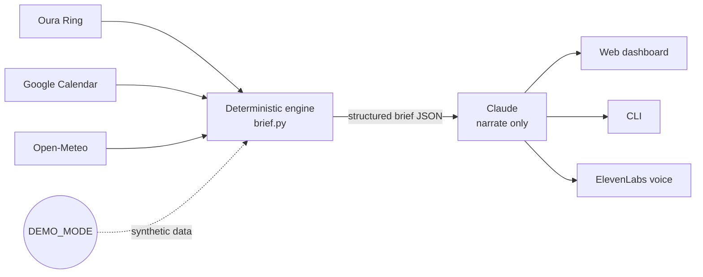

# Soma

Soma is a personal longevity tool. Each morning it pulls my Oura Ring data, combines it with my calendar and the local weather forecast, and produces a brief: a readiness verdict (green / yellow / red) and a handful of concrete, time-specific recommendations, when to get outside for light, when to train, when to eat, when to wind down. It then narrates that brief in plain language and, optionally, reads it aloud. I built it because I wanted daily guidance grounded in my own data rather than generic wellness advice, and because I wanted every recommendation to be something I could trace back to a number and a rule instead of trusting a model to decide what is good for me.

## How it works: the engine decides, the model narrates

The decision-making lives entirely in a deterministic, rule-based engine (`brief.py`). It z-scores each signal against my own rolling baseline, rolls those up into a readiness state, and selects recommendations from explicit rules that also account for my calendar and the weather. The output is a structured JSON brief.

The language model (Claude) only narrates that JSON into prose. It is instructed never to invent, add, or change a recommendation, every sentence it writes has to come from the brief it was given. Two reasons for splitting it this way:

- **Auditable.** Every verdict and recommendation maps to a specific value, baseline, and rule. I can point at why the brief said what it said. Nothing depends on the model's mood.
- **No hallucinated medical advice.** Because the model cannot introduce a recommendation that is not already in the JSON, it cannot make up health advice. It rephrases; it does not prescribe.

## Integrations

- **Oura Ring** — sleep, readiness, HRV, and activity, via a personal access token.
- **Google Calendar** — read-only access to the day's events, so recommendations land in actual free blocks.
- **Open-Meteo** — hourly forecast (no API key), used to time outdoor light around daylight and rain.
- **ElevenLabs** — text-to-speech, to read the brief aloud in a chosen voice.
- **Claude (Anthropic)** — narration only, as described above.

## Architecture



## Run it in demo mode

`DEMO_MODE` runs the whole app on a seeded synthetic profile: no real Oura, calendar, weather, or personal health data is read or written, and the clinic view shows synthetic patients only. It is the easiest way to try Soma from a clean clone, you only need an Anthropic key for narration (no Oura or Google setup).

```bash
git clone <your-fork-url> soma
cd soma
python3 -m venv venv && source venv/bin/activate
pip install -r requirements.txt

cp .env.example .env
# In .env, set:
#   DEMO_MODE=true
#   ANTHROPIC_API_KEY=sk-ant-...        (required: narration still uses Claude)
#   ELEVENLABS_API_KEY / ELEVENLABS_VOICE_ID  (optional: enables the voice button)

uvicorn api:app --reload --port 8000
```

Open <http://localhost:8000>. A "Demo data" badge confirms no real data is in use.

To run the command-line version instead:

```bash
DEMO_MODE=true python soma.py
```

To verify the guarantee yourself, that nothing real is reachable in demo mode:

```bash
DEMO_MODE=true python verify_demo.py
```

Turn `DEMO_MODE` off (or remove it) to run against real data, which then requires `OURA_TOKEN` and, for the calendar, Google OAuth credentials. Restart the server after changing the flag.

## Screenshots


*Morning brief and readiness dashboard.*


## Demo video

<!-- Replace with a link to the demo recording. -->

[Watch the demo] 

https://github.com/user-attachments/assets/6ffd1603-5894-4d9a-b5d6-1b942677ede3


